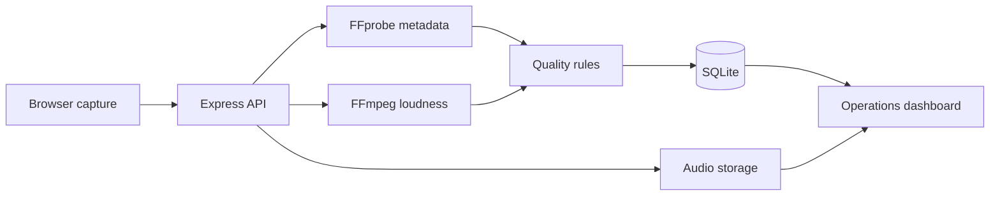

# FieldVoice

[](https://github.com/rohitsharma1232004/fieldvoice-audio-ops/actions/workflows/ci.yml)

**Voice-response collection and audio quality operations for distributed teams.**

FieldVoice gives research, customer-experience and field-operations teams one place to capture structured voice responses, automatically inspect recording quality, and move each response through a lightweight review workflow.

It is designed for real-world collection programmes where inconsistent devices, noisy environments and manual file handling make voice data difficult to trust at scale.

## Product capabilities

- Record from the browser or upload an existing audio file
- Attach contributor, project, response type and field context
- Extract duration, sample rate, bitrate and integrated loudness on the server
- Score each recording against an explainable four-part quality gate
- Monitor collection volume, contributors, pending reviews and readiness rate
- Search and filter the response library by person, project, review state or quality
- Play recordings in place and mark them approved or needing follow-up
- Preserve people and submission records in a relational SQLite schema
- Upgrade an existing database automatically with non-destructive schema migrations
- Validate file type, size, required data and phone format at the API boundary

## Why this project exists

Voice data is often collected through messaging apps, shared drives and spreadsheets. That creates three operational problems:

1. responses lose their project and contributor context;
2. unusable audio is discovered late; and
3. reviewers have no shared queue or approval state.

FieldVoice moves capture, audio QA and review into one workflow. Its quality score is intentionally rules-based and transparent, so an operations team can understand exactly why a recording passed or needs attention.

## System design



## Technology

| Layer | Technology | Responsibility |
| --- | --- | --- |
| Frontend | React 19, Vite, Lucide | Capture, dashboards, filtering and review UX |
| API | Node.js, Express 5 | Validation, uploads, queries and review workflow |
| Audio processing | FFprobe, FFmpeg `loudnorm` | Technical metadata and integrated loudness |
| Persistence | SQLite, better-sqlite3 | People, submissions and review state |
| Uploads | Multer | MIME and size validation, local file storage |
| Tests | Node test runner | Deterministic audio-quality rule tests |

The project uses `ffmpeg-static` and `ffprobe-static`, so a global FFmpeg installation is not required.

## Quality gate

Each recording receives 25 points for every passing check:

| Signal | Ready threshold |
| --- | --- |
| Duration | At least 2 seconds |
| Sample rate | At least 16 kHz |
| Bitrate | At least 32 kbps |
| Integrated loudness | Between -35 dB and -8 dB |

- **75–100:** ready
- **50:** manual review
- **0–25:** re-record recommended

The thresholds are isolated in `server/src/quality.js` so they can be adjusted for a programme's capture standards.

## Local setup

Requirements: Node.js 20 or 22 LTS and npm.

Start the API:

```bash
cd server
npm install
cp .env.example .env
npm run dev
```

Start the frontend in another terminal:

```bash
cd client
npm install
cp .env.example .env
npm run dev
```

Open `http://localhost:5173`. The API runs on `http://localhost:5000` by default.

On Windows PowerShell, use `Copy-Item .env.example .env` instead of `cp`.

## API surface

| Method | Endpoint | Purpose |
| --- | --- | --- |
| `GET` | `/api/health` | Service health |
| `POST` | `/api/submissions` | Upload and analyse a voice response |
| `GET` | `/api/submissions` | List and optionally filter responses |
| `GET` | `/api/overview` | Aggregate dashboard metrics |
| `PATCH` | `/api/submissions/:id/review` | Change review state |
| `GET` | `/uploads/:filename` | Stream stored audio |

The submission endpoint accepts multipart fields: `name`, `phone`, `projectName`, `responseType`, `notes` and `audio`.

## Data model

`people` stores a contributor once per phone number. `audio_submissions` stores project context, file information, technical metadata and the review lifecycle. Local data is created under:

```text
server/data/app.db
server/uploads/
```

Both paths are excluded from Git.

## Validation

Run the backend quality-rule tests:

```bash
cd server
npm test
```

Create a production frontend bundle:

```bash
cd client
npm run build
```

## Production roadmap

The current storage adapter is intentionally simple for local and single-instance deployments. A production rollout would replace local audio files with S3 or Azure Blob Storage, run FFmpeg analysis through a job queue, use PostgreSQL for shared persistence, add authenticated workspaces and keep an audit log for review changes.

## Portfolio summary

Built a full-stack voice operations platform using React, Express, SQLite and FFmpeg. Implemented browser recording, multipart uploads, server-side audio analysis, an explainable quality-scoring engine, operational dashboards, searchable review queues, schema migration and automated tests.
