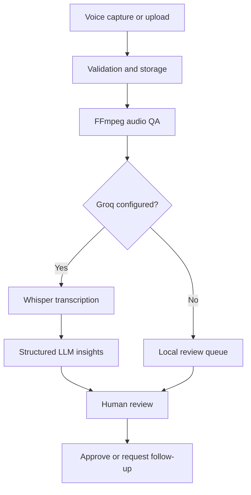

# VoiceOps AI

[](https://github.com/rohitsharma1232004/voiceops-ai-automation/actions/workflows/ci.yml)

**AI-powered voice intelligence and human-in-the-loop operations automation.**

VoiceOps AI turns field interviews, customer feedback and inspection recordings into quality-checked transcripts and structured operational insights. It combines deterministic audio QA with AI-assisted transcription and triage, then keeps approval and follow-up decisions with a human reviewer.

This is a portfolio-grade AI automation project built around a realistic workflow: unstructured voice enters the system, automation enriches it, and an operations team receives traceable outputs it can act on.

## What it automates

- Records audio in the browser or accepts existing audio uploads
- Links every response to a contributor, project, response type and field context
- Extracts duration, sample rate, bitrate and integrated loudness with FFmpeg
- Applies a transparent four-signal audio quality gate
- Transcribes speech through Groq's Whisper API
- Converts transcripts into a summary, sentiment, priority, category, topics and suggested next action
- Tracks queued, processing, completed and failed AI jobs with automatic UI polling
- Supports manual AI runs and safe retries after a failed request
- Exposes searchable response, quality and AI-processing views in one dashboard
- Keeps approve and follow-up actions under explicit human control
- Runs without an AI key, so the local quality and review workflow remains usable

## Automation workflow



## AI output contract

The analysis layer requests JSON and normalizes every response before persistence.

| Field | Allowed or expected value |
| --- | --- |
| `summary` | Grounded summary of the transcript |
| `sentiment` | `positive`, `neutral`, `negative`, `mixed` |
| `priority` | `low`, `medium`, `high`, `urgent` |
| `category` | Short operational category |
| `key_topics` | Up to six concise topics |
| `recommended_action` | Suggested next step for a reviewer |

The model is explicitly instructed not to approve or reject a response. AI output is assistive and should be verified by a human before action.

## System design

| Layer | Technology | Responsibility |
| --- | --- | --- |
| Frontend | React 19, Vite, Lucide | Capture, live AI state, insights, filters and review UX |
| API | Node.js, Express 5 | Validation, orchestration, uploads and workflow endpoints |
| Audio processing | FFprobe, FFmpeg `loudnorm` | Metadata extraction and integrated loudness |
| AI automation | Groq API, Whisper, Llama | Transcription and structured operational analysis |
| Persistence | SQLite, better-sqlite3 | Contributors, submissions, AI results and review state |
| Tests | Node test runner | Quality rules and AI-output normalization |

`ffmpeg-static` and `ffprobe-static` are included, so a global FFmpeg installation is not required.

## Local setup

Requirements: Node.js 20 or 22 LTS and npm.

Start the API:

```bash
cd server
npm install
cp .env.example .env
npm run dev
```

Start the frontend in another terminal:

```bash
cd client
npm install
cp .env.example .env
npm run dev
```

Open `http://localhost:5173`. The API runs on `http://localhost:5000` by default.

On Windows PowerShell, use `Copy-Item .env.example .env` instead of `cp`.

## Enable AI automation

Add a Groq API key to `server/.env`:

```env
GROQ_API_KEY=your_key_here
GROQ_TRANSCRIPTION_MODEL=whisper-large-v3-turbo
GROQ_ANALYSIS_MODEL=llama-3.1-8b-instant
AI_AUTO_PROCESS=true
```

Never commit `.env` or an API key. When the key is absent, VoiceOps AI clearly switches to local mode: capture, quality scoring, storage and human review continue to work, while AI actions stay disabled.

## API surface

| Method | Endpoint | Purpose |
| --- | --- | --- |
| `GET` | `/api/health` | Service health |
| `GET` | `/api/ai/status` | Safe provider/model configuration status |
| `POST` | `/api/submissions` | Upload, inspect and optionally queue a voice response |
| `GET` | `/api/submissions` | List and filter responses with AI results |
| `GET` | `/api/overview` | Aggregate collection, review and AI metrics |
| `POST` | `/api/submissions/:id/analyze` | Run or retry transcription and insight extraction |
| `PATCH` | `/api/submissions/:id/review` | Record a human review decision |
| `GET` | `/uploads/:filename` | Stream stored audio |

The upload endpoint accepts multipart fields: `name`, `phone`, `projectName`, `responseType`, `notes` and `audio`.

## Quality gate

Each recording receives 25 points for every passing check:

| Signal | Ready threshold |
| --- | --- |
| Duration | At least 2 seconds |
| Sample rate | At least 16 kHz |
| Bitrate | At least 32 kbps |
| Integrated loudness | Between -35 dB and -8 dB |

- **75–100:** ready
- **50:** manual review
- **0–25:** re-record recommended

The thresholds are isolated in `server/src/quality.js`, while AI response normalization lives in `server/src/ai.js`.

## Validation

```bash
cd server
npm test

cd ../client
npm run build
```

## Production roadmap

For a multi-tenant production deployment, move audio to object storage, place AI work on a durable queue, use PostgreSQL, add authenticated workspaces, encrypt sensitive contributor data and retain an audit log of model outputs and reviewer decisions.

## Portfolio summary

Built an AI voice-operations automation platform using React, Express, SQLite, FFmpeg and Groq. Designed an end-to-end pipeline for browser audio capture, deterministic quality scoring, Whisper transcription, schema-constrained LLM insight extraction, asynchronous processing, failure recovery and human-in-the-loop review.
